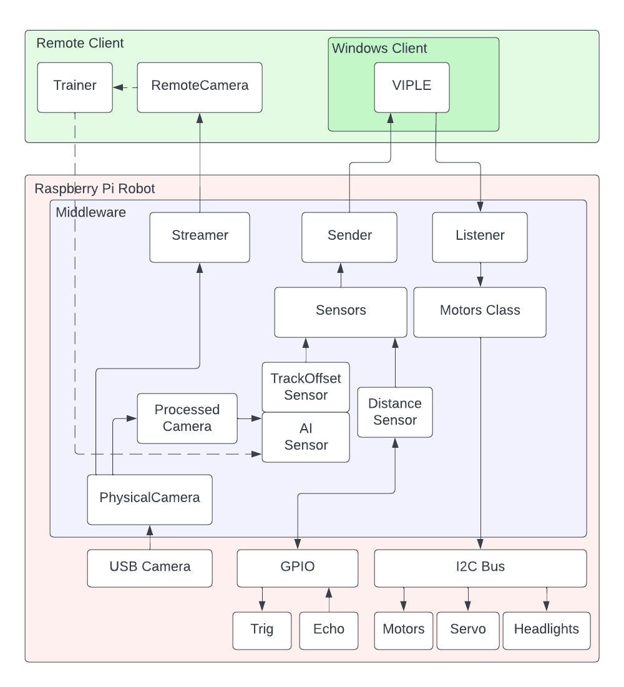

# Capstone Project: AI Robot Car
This repository contains artifacts related to the Capstone Project for:
- Matthew Bulger
- Sean O'Hair
- Matthew Griffin
- Jeffrey Adams
- Tengyu Wang
- Ethan Cota

## Motivation

The goal of this project is to create a functional robot based on the [LABISTS Raspberry Pi Smart Car](https://labists.com/products/raspberry-pi-smart-car-kit) hardware, that is able to autonomous navigate simple mazes, and follow simple tracks consisting of LEGO road tiles, using a camera, Computer Vision, and AI.

While the AI model and Computer Vision runs on the Raspberry Pi, the robot does not directly make decisions on how to move itself. Instead, the robot collects data from all of its attached sensors (the AI model, ultrasonic distance sensor, etc.), and sends this information over the network to another host running [VIPLE](https://venus.sod.asu.edu/VIPLE/), a visual programming language written by the sponsors of our project, Dr. Yinong Chen and Dr. Gennaro De Luca.

## About

The AI directory contains all files related to training the AI model.

See [Middleware README](./middleware/README.md) for detailed instructions on how to set up the Raspberry Pi robot, including installing dependencies, setting up an access point, the video streamer, and troubleshooting.

The VIPLE directory contains multiple sample VIPLE programs you can use. Some of them are "traditional", implying they don't use the AI model or camera, relying entirely on user input or the ultrasonic distance sensors. Others use the AI model to autonomously navigate a LEGO road.

Below is a flowchart indicating how the various components of this project work together.
